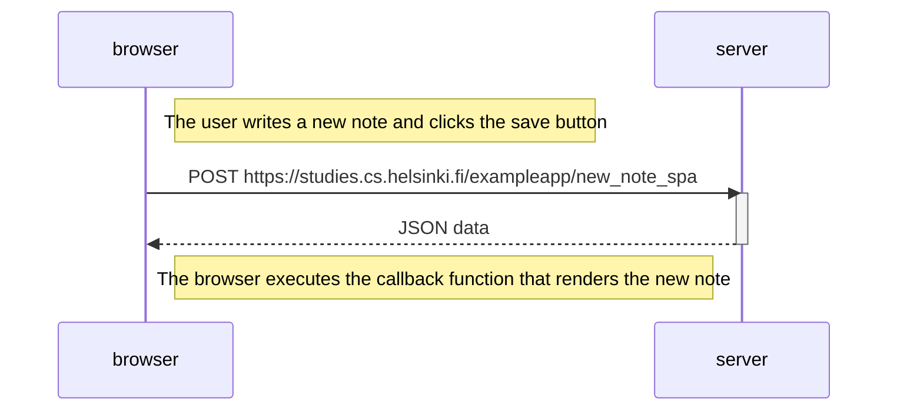

```mermaid
sequenceDiagram
    participant browser
    participant server


    Note right of browser: The user writes  a new note and clicks the save button

    browser->>server: POST https://studies.cs.helsinki.fi/exampleapp/new_note_spa
    activate server
    server-->>browser: JSON data
    deactivate server


     Note right of browser: The browser executes the callback function that renders the new note
```
